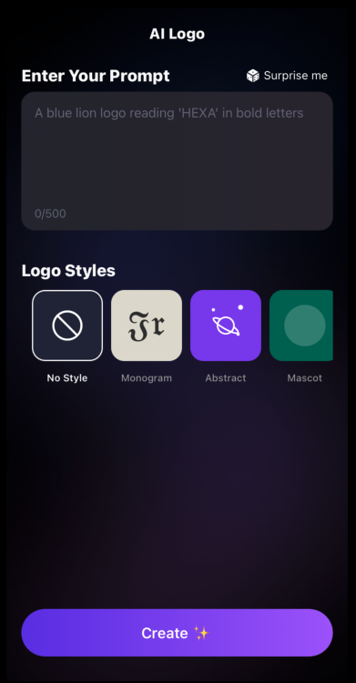
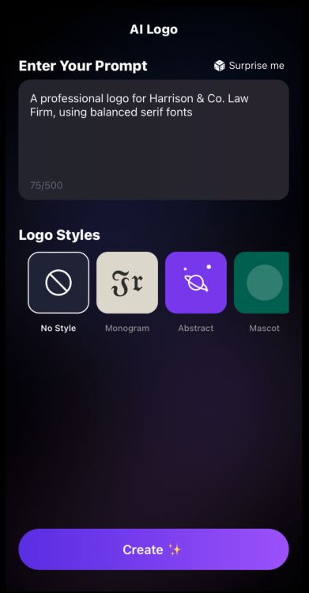
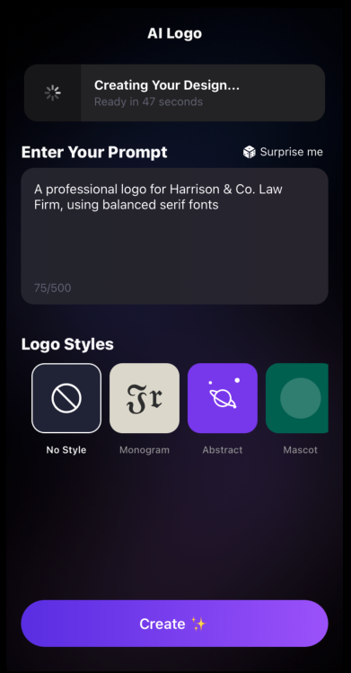
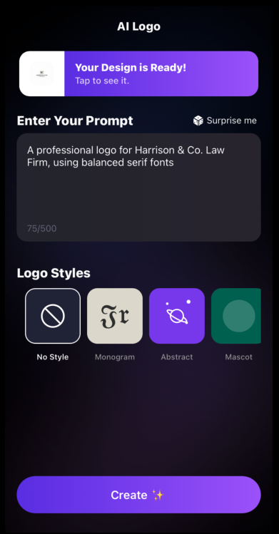
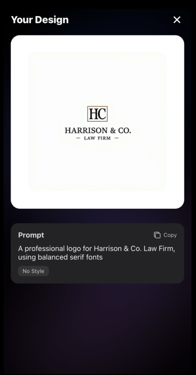

# HEXA - AI Logo Design

<iframe width="100%" height="400" src="https://www.youtube.com/embed/6FHfPMcAiBI?autoplay=1&mute=1" title="HEXA Demo" frameborder="0" allow="accelerometer; autoplay; clipboard-write; encrypted-media; gyroscope; picture-in-picture" allowfullscreen></iframe>

## Key Features

- Advanced logo generation system
- Multiple design styles (Monogram, Abstract, Mascot, Minimalist, Vintage)
- Real-time status tracking
- Cross-platform compatibility
- Cloud-based data management
- Intuitive user interface

## Screenshots

<div style="max-width: 800px; margin: 40px auto; padding: 0 20px;">
  <div style="display: flex; flex-direction: column; gap: 30px;">
    <div style="display: flex; gap: 20px; align-items: center;">
      <div style="flex: 1; background: #fff; padding: 12px; border-radius: 10px; box-shadow: 0 4px 12px rgba(0, 0, 0, 0.06);">
        
        <p style="text-align: center; margin-top: 10px; font-size: 13px; color: #444; font-weight: 500;">Main Interface</p>
      </div>
      <div style="flex: 1; background: #fff; padding: 12px; border-radius: 10px; box-shadow: 0 4px 12px rgba(0, 0, 0, 0.06);">
        
        <p style="text-align: center; margin-top: 10px; font-size: 13px; color: #444; font-weight: 500;">Style Selection</p>
      </div>
    </div>
    <div style="display: flex; gap: 20px; align-items: center;">
      <div style="flex: 1; background: #fff; padding: 12px; border-radius: 10px; box-shadow: 0 4px 12px rgba(0, 0, 0, 0.06);">
        
        <p style="text-align: center; margin-top: 10px; font-size: 13px; color: #444; font-weight: 500;">Prompt Input</p>
      </div>
      <div style="flex: 1; background: #fff; padding: 12px; border-radius: 10px; box-shadow: 0 4px 12px rgba(0, 0, 0, 0.06);">
        
        <p style="text-align: center; margin-top: 10px; font-size: 13px; color: #444; font-weight: 500;">Generation Process</p>
      </div>
    </div>
    <div style="display: flex; gap: 20px; align-items: center;">
      <div style="flex: 1; background: #fff; padding: 12px; border-radius: 10px; box-shadow: 0 4px 12px rgba(0, 0, 0, 0.06);">
        
        <p style="text-align: center; margin-top: 10px; font-size: 13px; color: #444; font-weight: 500;">Result Screen</p>
      </div>
    </div>
  </div>
</div>

## Technical Stack

- React Native
- TypeScript
- Firebase/Firestore
- Expo
- Linear Gradient
- Vector Icons

## Project Structure

```
src/
├── components/     # Reusable UI components
├── screens/        # Application screens
├── services/       # Firebase and other services
├── styles/         # Global styles and theme
├── types/          # TypeScript type definitions
└── utils/          # Utility functions
```

## Implementation Details

### Core Components

1. **LogoGeneratorScreen**
   - Main interface for logo creation
   - Real-time status updates
   - Style selection system
   - Input validation

2. **OutputScreen**
   - Result display
   - Design preview
   - Export functionality

3. **DesignStatusChip**
   - Status indicator
   - Progress tracking
   - Interactive feedback

### Data Flow

1. User input processing
2. Style selection validation
3. Generation request handling
4. Status management
5. Result processing
6. Data persistence

### State Management

- Local state for UI components
- Cloud state for design data
- Real-time status synchronization

Project Link: [https://github.com/ozkanydin/hexa](https://github.com/ozkanydin/hexa) 